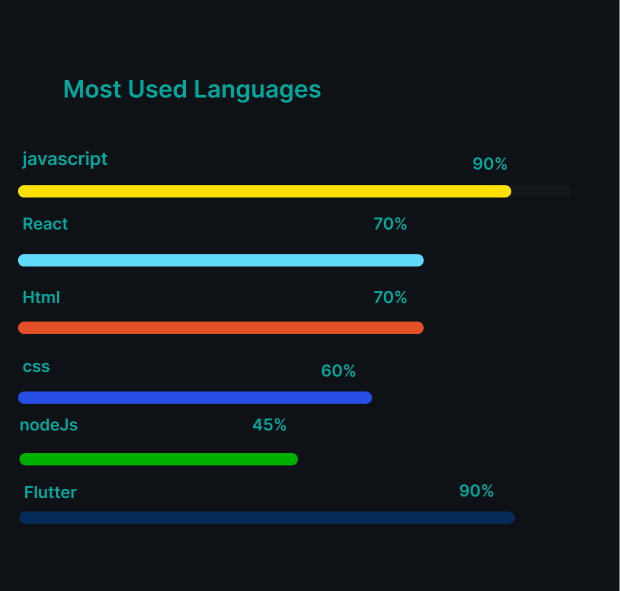

<h3 align="center">A New York based Full-stack developer</h3>

<table style="border: 1px solid rgba(0, 0, 0, 0.1); border-radius: 10px; background-color: #f9f9f9; padding: 20px;">
  <tr>
    <td style="vertical-align: top; padding-right: 20px;">
      <ul style="list-style: none; padding: 0; margin: 0;">
        <li>🔭 I’m Doing Masters at State University of New York at Binghamton</li>
        <li>👯 Looking for collaborate on Web Development projects using React</li>
        <li>👨‍💻 Have a look at my Projects at: https://github.com/Balajibalu7899?tab=repositories</li>
        <li>💬 Ask me about: React, NodeJs, ExpressJS,Kubernetes,Aws,Firebase</li>
        <li>📫 Mail Me at: <strong>balajigv.inbox@gmail.com</strong></li>
        <li>⚡I love experimenting with new technologies and tools, always on the lookout for ways to improve my development workflow.</li>
      </ul>
    </td>
    <td style="vertical-align: top;">
      
    </td>
  </tr>
</table>
 

  

 
<h2 align="left">Teach Stack</h2>
<!--UI-->
<h3>UI/UX</h3>

<!--Front-End-->
<h3>Front-End</h3>

<!--Back-End-->
<h3>Back-End</h3>

<!--DataBase-->
<h3>Databases</h3>

<!--Cloud-->
<h3>Cloud</h3>

<!--CI-CD-->
<h3>CI & CD</h3>

<!--Containerization-->
<h3>Containerization</h3>

<!--Orchestration-->
<h3>Orchestration</h3>

<!--Monitoring-->
<h3>Monitoring</h3>

 
 
<table style="border: none; border-collapse: collapse;">
  <tbody>
    <tr>
      <td>
        
      </td>
      <td>
        
      </td>
    </tr>
  </tbody>
</table>
<article>
   
</article>
<article>
   
</article>
<h3 align="left">Connect with me:</h3>

  &nbsp;&nbsp;&nbsp;
  

